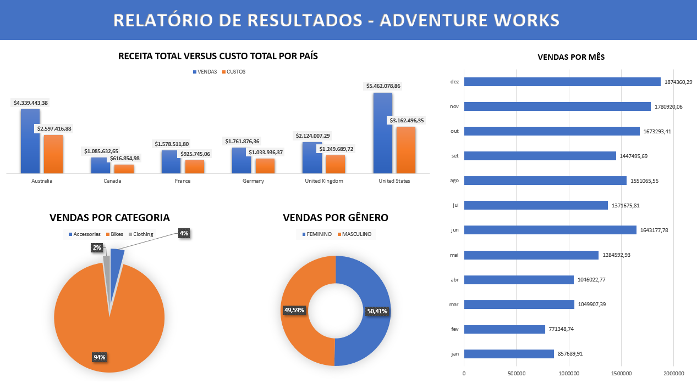

# Projeto de Integração SQL Server e Excel: Análise de Vendas da AdventureWorks Cycles

## Apresentação

Este projeto tem como objetivo integrar o banco de dados AdventureWorks do SQL Server com o Excel para analisar as vendas online da empresa fictícia AdventureWorks Cycles. O foco principal é extrair informações pertinentes sobre as vendas realizadas em 2013 e apresentá-las de maneira clara e organizada no Excel.

## Indicadores do Projeto

Os indicadores analisados neste projeto são:
Total de vendas online por categoria de produto
Receita total online por mês do pedido
Receita e custo total online por país
Total de vendas online por sexo do cliente

## Tabelas Analisadas

As tabelas do banco de dados AdventureWorks utilizadas neste projeto são:
FactInternetSales: Contém informações sobre as vendas online, como número do pedido, data, quantidade vendida, custo e receita.
DimCustomer: Contém informações sobre os clientes, como nome, sobrenome e sexo.
DimSalesTerritory: Contém informações sobre os territórios de vendas, como país.
DimProductCategory: Contém informações sobre as categorias de produtos, como nome.
DimProductSubcategory: Contém informações sobre as subcategorias de produtos.
DimProduct: Contém informações sobre os produtos.

## Colunas da View VENDAS

Para facilitar a análise dos dados, foi criada a view VENDAS com as seguintes colunas:

```sql
SELECT
	*
FROM 
	VENDAS

CREATE OR ALTER VIEW VENDAS AS 
SELECT
	StandardCost AS 'CUSTO',
	EnglishProductCategoryName 'CATEGORIA_PRODUTO',
	OrderQuantity AS 'ORDEM_QUANTIDADE',
	SalesAmount AS 'QUANTIDADE_VENDIDA',
	OrderDate AS 'DATA_VENDA',
	SalesOrderNumber AS 'NUMERO_ORDEM',
	CONCAT(FirstName, ' ', LastName) AS 'CLIENTE',
	SalesTerritoryCountry 'PAIS',

	CASE Gender
	WHEN 'M' THEN 'MASCULINO'
	WHEN 'F' THEN 'FEMININO'
	ELSE 'NÃO IDENTIFICADO'
	END AS 'GENERO'

FROM
	DimProduct
INNER JOIN
	DimProductSubcategory
ON
	DimProduct.ProductSubcategoryKey = DimProductSubcategory.ProductSubcategoryKey
INNER JOIN
	DimProductCategory
ON
	DimProductSubcategory.ProductCategoryKey = DimProductCategory.ProductCategoryKey
INNER JOIN
	FactInternetSales
ON
	DimProduct.ProductKey = FactInternetSales.ProductKey
INNER JOIN
	DimCustomer
ON
	FactInternetSales.CustomerKey = DimCustomer.CustomerKey
INNER JOIN
	DimSalesTerritory
ON
	FactInternetSales.SalesTerritoryKey = DimSalesTerritory.SalesTerritoryKey
WHERE
	StandardCost IS NOT NULL AND
	YEAR(OrderDate) = '2013'
```

## Integração com o Excel

Após a criação da view VENDAS, os dados foram importados para o Excel utilizando ferramentas como Microsoft Query ou Power Query. No Excel, foram criadas tabelas dinâmicas, gráficos e outros recursos para analisar os indicadores de vendas definidos no projeto.

## Dashboard Resultante



### Screenshots e Exemplos

Abaixo estão algumas imagens do dashboard gerado:

### Receita Total versus Custo Total por País


### Vendas por Mês


### Vendas por Categoria


### Vendas por Gênero


## Conclusão

Este trabalho demonstra como integrar dados do SQL Server com o Excel para a análise eficaz das vendas, proporcionando insights valiosos para a tomada de decisões. O uso da view VENDAS simplificou o processo de extração de dados e permitiu uma análise mais ágil e visual no Excel.
Através da análise de vendas da AdventureWorks Cycles, podemos extrair alguns insights importantes:
Desempenho de vendas por categoria de produto: Podemos identificar quais categorias de produto têm maior ou menor desempenho em termos de vendas online. Isso pode ajudar a direcionar esforços de marketing e tomadas de decisão relacionadas à oferta de produtos.
Tendências de vendas ao longo do tempo: Ao analisar a receita total online por mês do pedido, podemos identificar padrões sazonais ou tendências de crescimento nas vendas ao longo do ano. Essas informações são valiosas para o planejamento estratégico e de estoque.
Análise de vendas por país: Ao analisar a receita e o custo total online por país, podemos identificar quais países têm o maior volume de vendas e onde os recursos estão sendo investidos proporcionalmente. Isso permite uma alocação de recursos mais eficiente e a identificação de mercados que podem ser promissores para expansão.
Segmentação do mercado por sexo do cliente: Ao analisar o total de vendas online por sexo do cliente, podemos identificar diferenças no comportamento de compra entre homens e mulheres. Essas informações são valiosas para personalização de marketing e campanhas direcionadas.
Esses são apenas alguns exemplos dos dados relevantes que podem ser extraídos da análise de vendas da AdventureWorks Cycles. Com base nesses insights, é possível tomar decisões informadas para impulsionar o crescimento e o sucesso do negócio.
